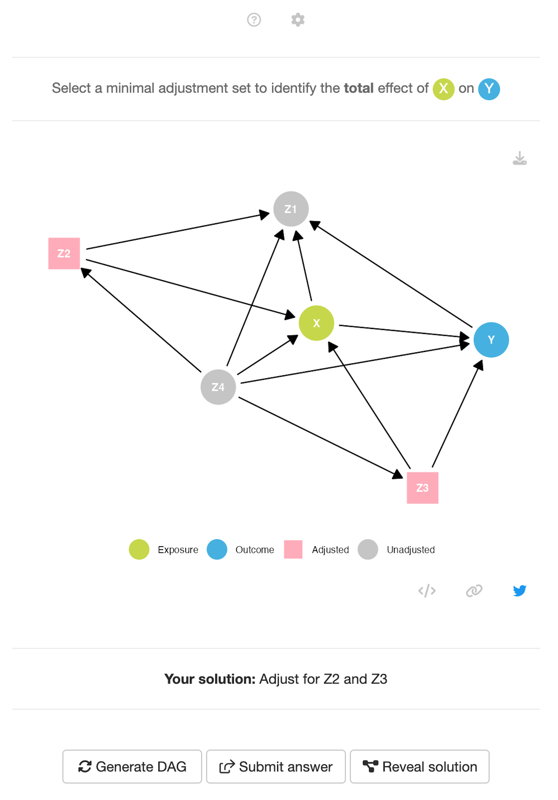

<!-- README.md is generated from README.Rmd. Please edit that file -->

```{r, include = FALSE}
knitr::opts_chunk$set(
  collapse = TRUE,
  comment = "#>",
  fig.path = "man/figures/README-",
  out.width = "100%"
)
```

# Daggle

<!-- badges: start -->
[](https://github.com/CBDRH/daggle/actions/workflows/check-release.yaml)
[](https://lifecycle.r-lib.org/articles/stages.html#experimental)
<!-- [](https://app.codecov.io/gh/CBDRH/daggle?branch=main) -->

<!-- badges: end -->

## Introduction

The daggle package is a [Golem](https://golemverse.org/)—a shiny app shipped in an R package. The app source code can be found here on GitHub but the daggle app can be accessed online at http://cbdrh.shinyapps.io/daggle. 

The aim of the daggle app is to support people teaching and learning the basic rules of using directed acyclic graphs (DAGs) to identify minimally sufficient adjustment sets when estimating causal effects. 

## Features

The application offers two modes: tutorial and random. The tutorial mode presents a guided introduction to how common causal structures can be presented using DAGs and how graphical rules can be used to identify minimally sufficient adjustment sets for causal estimation. The random mode tests this understanding by presenting the user with a randomly generated DAG—a _daggle_. To solve the daggle, users must correctly identify a valid minimally sufficient adjustment set.

Users solve the daggle by selecting a minimally sufficient adjustment set that would allow the the specified effect of an exposure `X` on an outcome `Y` to be estimated without bias. Tapping or clicking on a node turns the node from a light grey circle to a pick square, and indicates that the variable should be adjusted for in the analysis. The effect of interest can specified as the total effect of direct effect. Users can also change the number of nodes and complexity of the randomly generated DAGs



In this daggle, users must select a minimal adjustment set to identify the total effect of `X` on `Y`. Here, the nodes `Z2` and `Z3` can be selected. You can try to solve this daggle online here: [cbdrh.shinyapps.io/daggle/?_values_&id=145590](https://cbdrh.shinyapps.io/daggle/?_values_&id=145590) 


## Installation

You can install the development version of daggle from [GitHub](https://github.com/) with:

``` r
# install.packages("devtools")
devtools::install_github("CBDRH/daggle")
```

## Publication 

_coming soon_


